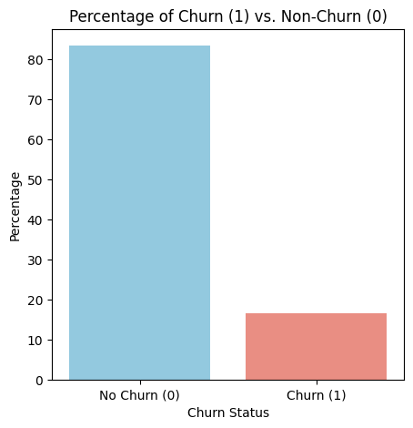
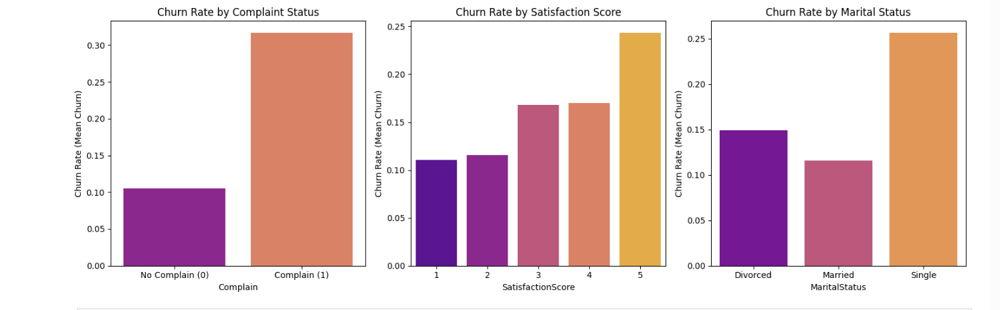
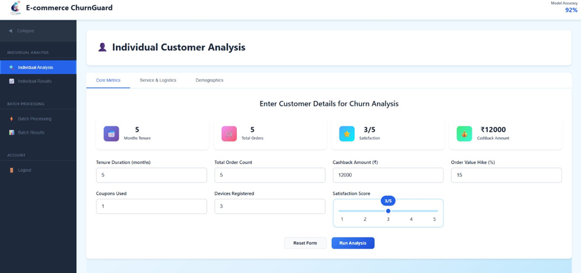
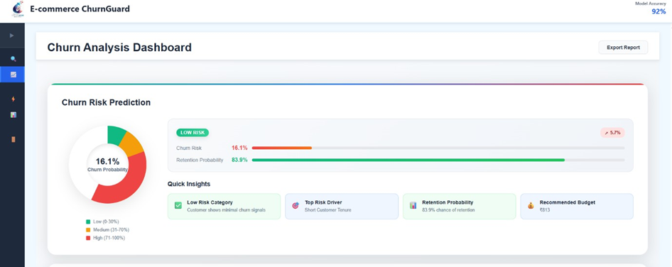
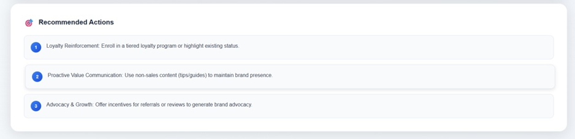
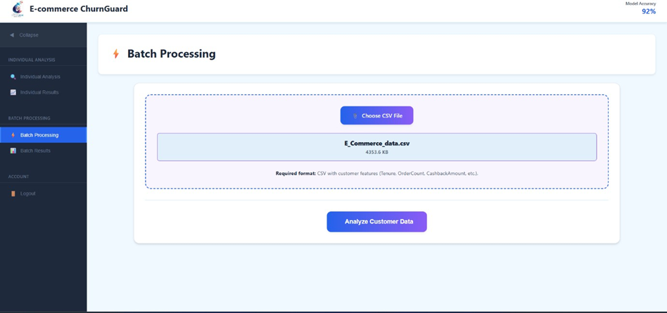
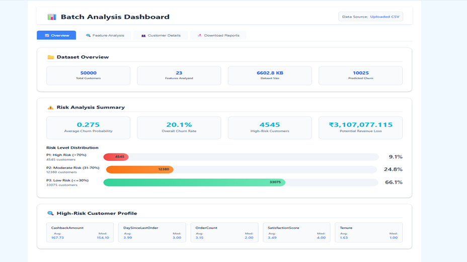
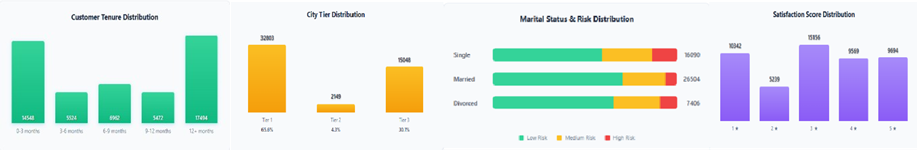
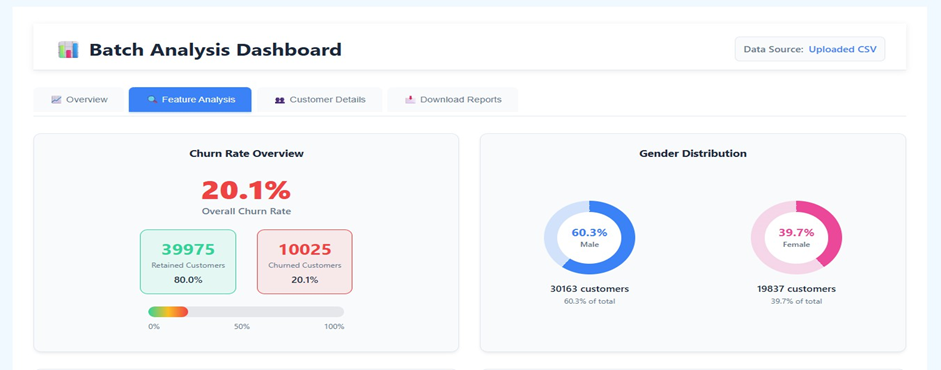
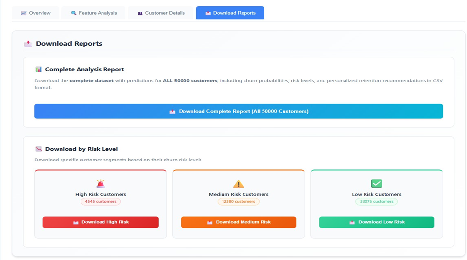

Project Overview 
The Churn Intelligence system is a full-stack application designed to predict customer churn in an E-commerce business. It utilizes an advanced Ensemble Machine Learning Model on the backend to provide accurate, actionable predictions and business impact analysis, all accessible through a modern React frontend.

Key Features ✨<br>
Advanced Prediction: Single and batch prediction capabilities using an Ensemble ML Model.

Intelligent Data Preprocessing: Smart NaN imputation and automatic feature engineering.

Business Impact Analysis: Estimation of Customer Lifetime Value (CLV), potential revenue loss, and optimal retention budget.

Reporting & Filtering: Download full reports and filter customers based on their churn risk (High/Medium/Low).

📘 Churn Intelligence – React + Flask Application

A full-stack E-commerce Customer Churn Prediction System built with:

Frontend: React.js

Backend: Flask (Python)

ML Model: Ensemble (Random Forest + XGBoost + CatBoost)

Features:
✔ Single prediction
✔ Batch prediction
✔ Batch analysis
✔ Download full reports
✔ Risk-wise customer filtering
✔ Smart NaN imputation
✔ Business impact analysis
✔ Feature importance approximation

Among all tested models, **Random Forest achieved the highest accuracy of 94.38%** on the E-commerce churn dataset.


---

# 📈 Dataset Insights

## Churn Distribution



## Feature-wise Churn Analysis



---

# 🖥️ Application Screenshots

## Individual Customer Analysis



## Churn Risk Dashboard



## Recommended Actions



## Batch Processing



## Batch Analysis Dashboard



## Feature Analysis Dashboard



## Customer Distribution Analysis



## Download Reports




---

# 🧠 Intelligent Backend Features

## ✔ Smart NaN Imputation

Automatically repairs missing values using:

- Median / Mean
- Mode for categorical values
- ML-based estimation for:
  - CashbackAmount
  - OrderCount
  - Tenure
  - SatisfactionScore

---

## ✔ Feature Engineering

Automatically creates:

- ValueScore
- EngagementIntensity
- OrderFrequency
- CashbackPerOrder
- HighRecencyFlag
- LowSatisfactionFlag
- ComplaintFlag

---

## ✔ Business Impact Analysis

For each prediction:

- Customer Lifetime Value (CLV)
- Revenue Loss Estimation
- Retention Probability
- Retention Budget Recommendation
- ROI Approximation

---

# ⚙️ Backend Setup (Flask API)

## 1️⃣ Create Virtual Environment

```bash
cd backend
python -m venv venv
venv\Scripts\activate
```

## 2️⃣ Install Dependencies

```bash
pip install -r requirements.txt
```

## 3️⃣ Start Flask Server

```bash
python app.py
```

Runs on:

```bash
http://localhost:5000
```

---

# 🖥️ Frontend Setup (React)

## 1️⃣ Install Node Modules

```bash
cd frontend
npm install
```

## 2️⃣ Create `.env` File

```env
REACT_APP_API_BASE=http://localhost:5000
```

## 3️⃣ Start React App

```bash
npm start
```

Runs on:

```bash
http://localhost:3000
```

---

# 🔗 Frontend–Backend Integration

## Single Prediction API

```javascript
axios.post(`${process.env.REACT_APP_API_BASE}/api/predict`, formData)
```

## Batch Prediction API

```http
POST /api/batch-predict
```

## Download Full Report

```http
POST /api/batch/download-report
```

## Download Risk Customers

```http
POST /api/batch/download-risk-customers
```

---

# 📦 Required Model Artifacts

Place these files inside:

```bash
backend/Artifacts/
```

Required files:

```bash
best_rf_xgb_cat_ensemble.pkl
feature_names.pkl
```

---

# 📡 API Endpoints

| Endpoint | Method | Description |
|---|---|---|
| `/api/predict` | POST | Single customer churn prediction |
| `/api/batch-predict` | POST | Batch customer prediction |
| `/api/batch/analyze` | POST | Full batch analytics |
| `/api/batch/download-report` | POST | Download complete report |
| `/api/batch/download-risk-customers` | POST | Download customers by risk |
| `/api/benchmarks` | GET | Benchmark metrics |
| `/api/health` | GET | API health check |

---

# 📊 API Testing (Postman)

## Single Prediction

```json
{
  "Tenure": 12,
  "CityTier": 2,
  "WarehouseToHome": 20,
  "SatisfactionScore": 4,
  "OrderCount": 8,
  "DaySinceLastOrder": 15,
  "CashbackAmount": 6000
}
```

## Batch Prediction

Upload CSV using:

```text
form-data
file: customers.csv
```

---

# 🛠️ Tech Stack

## Frontend
- React.js
- Axios
- Bootstrap / CSS

## Backend
- Flask
- Pandas
- NumPy
- Scikit-learn
- XGBoost
- CatBoost

## Machine Learning
- Random Forest
- XGBoost
- CatBoost
- Ensemble Voting

---

# 📌 Future Improvements

- Real-time deployment using Docker
- Cloud deployment (AWS/Azure)
- Live customer monitoring
- Advanced explainable AI (SHAP/LIME)
- Email notification system

---


